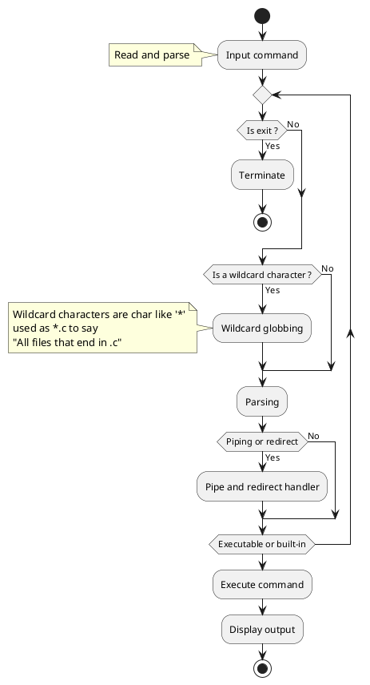

To understand how to make a mini-shell we first need to understand how a normal shell works.

# Basics
To start off we will talk about commands, there are two different types of commands.
- Built-in commands : Built-in commands are commands that are directly implemented into the core of the shell.
- Executable files : Executable files are commands that actually execute another program. We could imagine making a _sum_ program in _C_ that takes in _args_. When we compile this program we can execute it using ./sum arg1 arg2. This is the same concept but here the shell will look through a specific directory to find the file name that corresponds to the command entered.

With this out of the way, we look at how do we treat a command. The steps are :
1. Read the command : Retrieve what the user has typed and by able to split the command into different parts
2. Parse (tokenize) : We then want to be able to store and manipulate each individual aspect of the command.
3. Execute : Analyze the different tokens to see what needs to be executed then we execute what needs to be executed.

For user purposes the prompt displays the current path the shell is located in with and "entry symbol" such as a _$_. 

